### Project overview
The task of this project is to train a model to detect vehicles, pedestrians and cyclists from images. The images are extracted from vehicle camera recordings of the [Waymo Open Dataset](https://waymo.com/open/) and fed to the model. The environment perception using the optical camera is crucial for autonomous driving as the camera is capable of object classification.
Additionally, the camera is way more cheaper compared to the LiDAR sensor.

### Set up
The following tools are needed for this project: Python, Jupyter Notebook.

### Dataset
#### Dataset analysis
The data set used in this project reflects different situations a self-driving car might face in reality. The images cover urban, rural and highway scenarios, respectively. Additionally, the data set covers different environmental circumstances such as nightly, foggy or rainy scences.

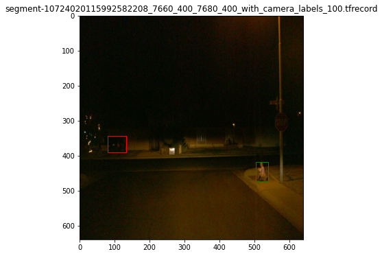
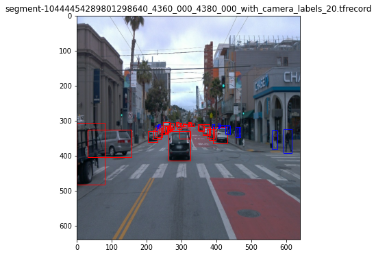
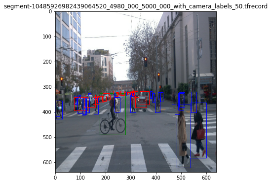
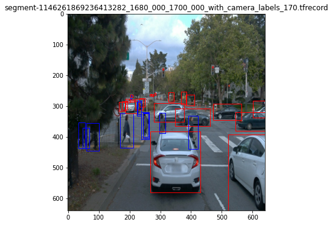

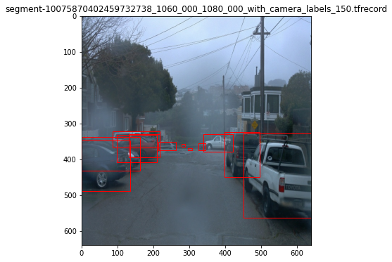
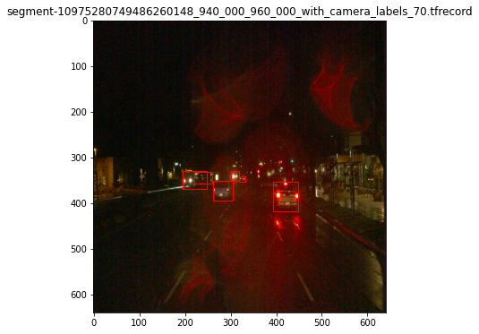
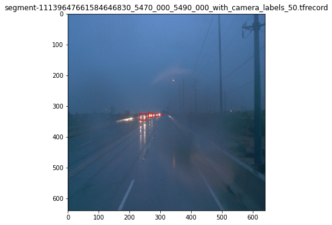

Further analyis of 10000 batches shows that the majority of images contains cars or pedestrians. Cyclists are rather under represented as shown in the below bar plot.

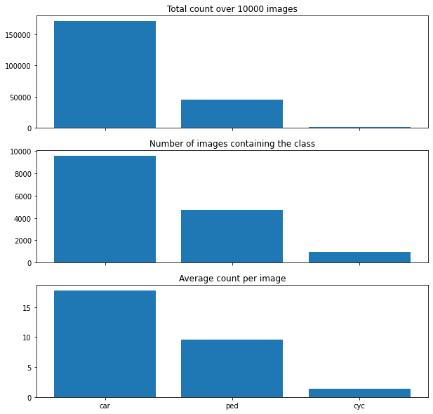
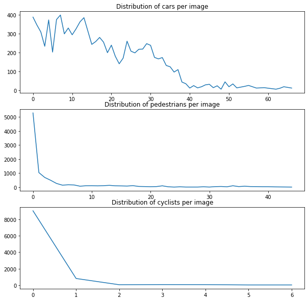

#### Cross validation
The data set is separated into training, testing and validation sets. It is important to note that the data has to be shuffled randomly before distribution. This way an equal distribution can be ensured among the samples of each subset. It is also important to mention that the sets are proportioned in specific rations to avoid overfitting of the model. 10 % each are used for both the testing and validation set. The rest is used for training.

### Training
#### Disclaimer
I did the project on the Udacity Workspace. Unfortunately, I ran out of disk space while tuning the model. As a result, I was not able to plot the validation data as I had to delete older checkpoints to have space on my disk. Additionally, I was not able to keep multiple experiments on the disk to compare them in tensorflow.

#### Reference experiment
The training results of the pretrained ResNet model don't look promising as shown below.
  

#### Improve on the reference
##### Augmentations
One way to improve the reference was the usage of the data set augmentation. This can be configured in the config file as shown below:
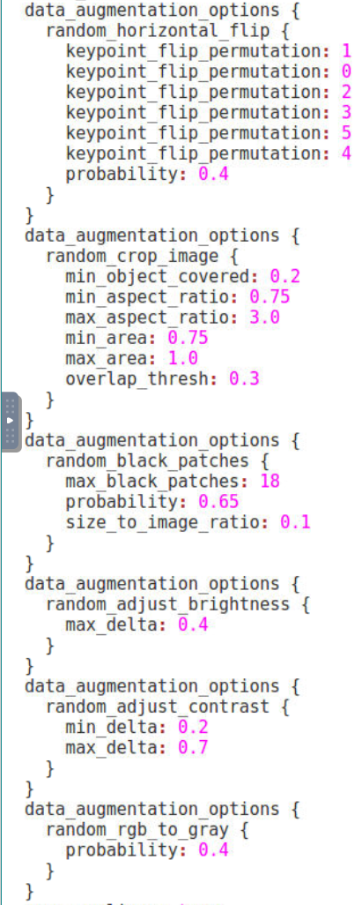

This is how the config affected the images:
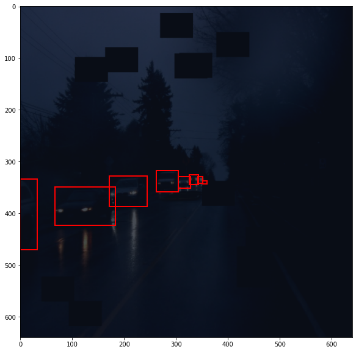 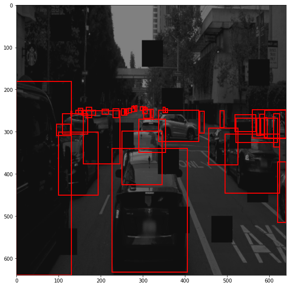

##### Change the configs
Another way to improve the reference was to change the trainings parameter such as the optimizer. The reference model used a momemtum optimizer. To explore how it affects the model, I used the Adam optimizer with an exponential decay. As I ran into the disk space issues, I also reduced both the batch size and the number of steps.
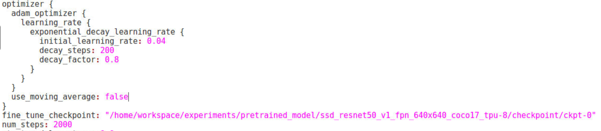

As depicted below, we can observe that the loss values are very high (>> 0).
This is an indicator that the parameters are not set correctly yet.
My first guess is that the initial learning rate is set way too high.
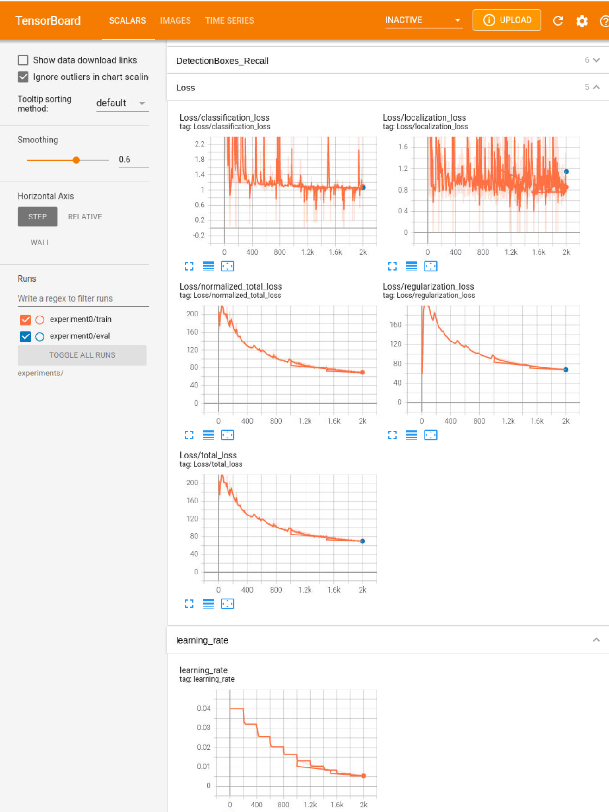

