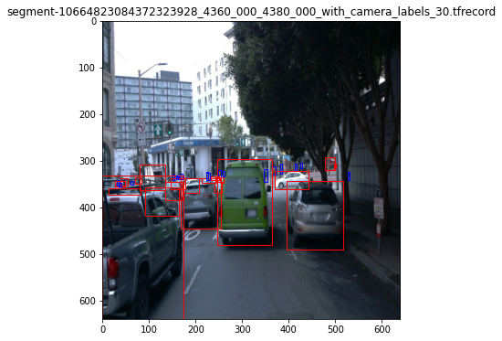

### Project overview
The task of this project is to train a model to detect vehicles, pedestrians and cyclists from images. The images are extracted from vehicle camera recordings of the [Waymo Open Dataset](https://waymo.com/open/) and fed to the model. The environment perception using the optical camera is crucial for autonomous driving as as the camera is capable of object classification.
Additionally, the camera is way more cheaper compared to the LiDAR sensor.

### Set up
The following tools are needed for this project: Python, Jupyter Notebook. Follow above-mentioned steps to the get the data to train the model.

### Dataset
#### Dataset analysis
The data set used in this project reflected different situation a self-driving car might face in reality. The images covered urban, rural and highway scenarios, respectively. Additionaly, the data set covered different environmental circumstances such as nightly, foggy or rainy scences.

#### Cross validation
This section should detail the cross validation strategy and justify your approach.

### Training
#### Reference experiment
This section should detail the results of the reference experiment. It should includes training metrics and a detailed explanation of the algorithm's performances.

#### Improve on the reference
This section should highlight the different strategies you adopted to improve your model. It should contain relevant figures and details of your findings. 
